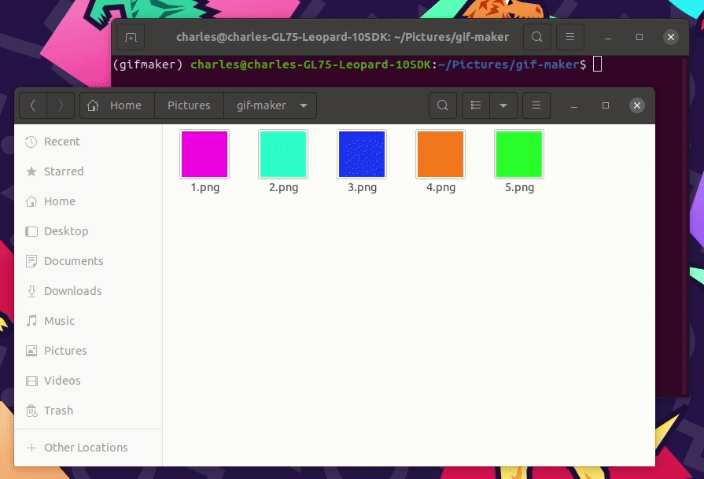

# gif-maker
Convert a sequence of images to an animated GIF directly from the command line!



# Installation
A `python3` installation is required to use the package. You can install the package and its dependencies with
```
pip install -e .
```

# Usage
To generate an animated GIF, simply run
```
gifmaker path/to/input0.png [path/to/input1.png path/to/input2.png ...] path/to/output.gif
```

Run `gifmaker --help` for additionnal documentation.
Images will be assembled in the order in which they are passed to the script.
